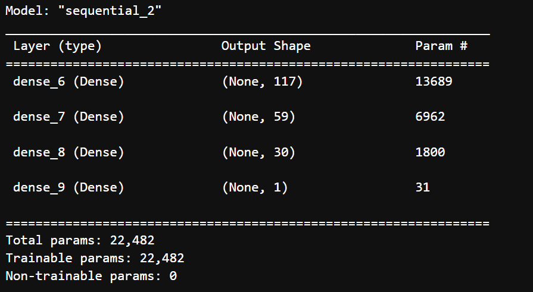
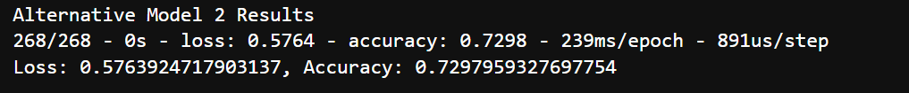

# CFB_Mod13_Challenge: Venture CapitalPerformance

This is a Python-based neural networks tool that predicts whether potential venture capital investments may be successful. The tool incorporates a binary classification model using a deep neural network.  The first step is to pre-process the data.  The second step is to use the model-fit-predict pattern and evaluate a binary classification model. Finally, the last step is to optimize the model by changing the inputs, such as number of nodes, layers or epochs.

---

## Technologies

The application is written in Python 3.7 in a Jupyter notebook with support from the following packages:  

*[Pandas] (https://github.com/pandas) - Data Analysis

*[SKLearn] (https://github.com/scikit-learn) - Advanced Data Anaylsis and Machine Learning:  StandardScaler / OneHotEncoder

*[Path] (https://github.com/path) - CSV File Reading

*[TensorFlow] (https://github.com/tensorflow) - Neural Network Applications

## Installation Guide

Install TensorFlow through the command **pip install -upgrade tensorflow**

Install scikit-learn through command **pip install -U scikit-learn**

## Usage and Content

To see the analysis, pls clone the repository and open **venture_funding_with_deep_learning** in JupyterLab.  

Here are some images from the tool:

## Contributors
Vishnu Kurella, vishnu.kurella@gmail.com

## License
VK.LQA 2021
